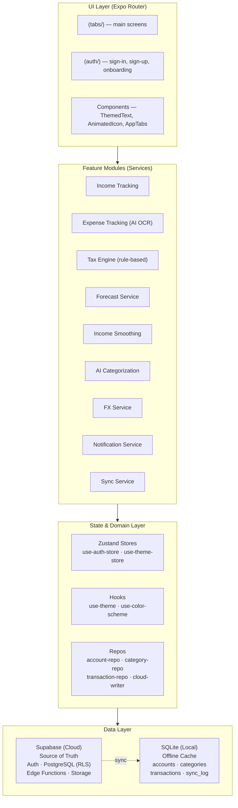
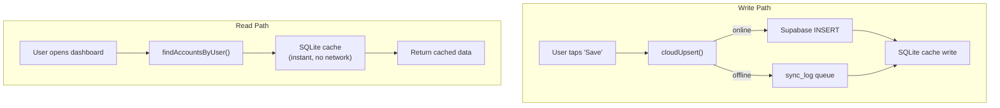
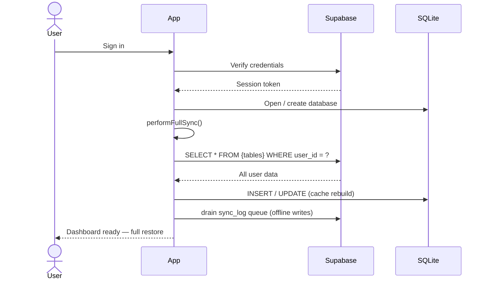

# SmoothTax

**Smooth income. Know your taxes. Freelancer-native.**

Cross-platform React Native + Expo personal finance app for freelancers and solopreneurs. Tracks irregular income across multiple currencies, computes a "safe monthly pay" to smooth dry months, and provides live localized quarterly tax estimates. Features AI-powered insights, receipt OCR, mileage tracking, cash flow forecasting, client management, and seamless multi-device sync.

---

## Features

### Income & Expense Tracking
- Multi-currency income/expense with automatic FX normalization
- AI-assisted categorization from transaction descriptions
- Receipt OCR — snap a photo, AI extracts merchant/amount/date/tax
- Manual + recurring transaction templates

### Income Smoothing *(our wedge)*
- Computes a "safe monthly pay-yourself" amount from irregular income
- Projects dry-month buffer requirements
- Visual 12-month cash-flow ribbon with buffer health indicator

### Tax Engine
- Rule-based quarterly estimation per locale (US federal + state)
- Live recomputation as transactions land
- Set-aside guidance and quarterly deadline reminders
- Export-ready Schedule C summary and CSV

### Multi-Currency
- Native multi-currency income/expense with live FX rates
- Per-currency account balances with consolidated base-currency net worth
- All tax math normalised to base currency

### AI-Powered Insights
- Receipt OCR + data extraction via Supabase Edge Functions
- Auto-categorization with few-shot learning + user corrections
- Natural-language Q&A ("Can I pay myself $4k this month?")
- Cash-flow forecasting based on historical seasonality

### Cloud Sync & Offline
- Supabase is the source of truth; SQLite is the local cache
- Instant reads from local cache — zero network round-trips for daily use
- Offline queue: writes queue locally and flush when connectivity returns
- Full cache rebuild on sign-in — clear app data and everything restores from cloud

---

## Architecture



### Data Flow



### Sign-In Restore Flow



---

## Tech Stack

| Layer | Technology |
|---|---|
| **Framework** | [Expo SDK 56](https://docs.expo.dev/versions/v56.0.0/) + [React Native 0.85](https://reactnative.dev/) |
| **Language** | [TypeScript 6.0](https://www.typescriptlang.org/) (strict mode) |
| **Routing** | [Expo Router](https://docs.expo.dev/router/introduction/) (file-based, typed routes) |
| **State** | [Zustand](https://github.com/pmndrs/zustand) |
| **Local Database** | [expo-sqlite](https://docs.expo.dev/versions/latest/sdk/sqlite/) |
| **Cloud Database** | [Supabase](https://supabase.com/) (PostgreSQL + Row-Level Security) |
| **Auth** | [Supabase Auth](https://supabase.com/auth) (email/password + OAuth) |
| **AI** | [Supabase Edge Functions](https://supabase.com/docs/guides/functions) (receipt OCR, categorization, insights) |
| **Storage** | [Supabase Storage](https://supabase.com/storage) (encrypted receipt images) |
| **Web Support** | [react-native-web](https://necolas.github.io/react-native-web/) + platform-split `.web.tsx` files |
| **UI** | Custom themed components (`ThemedText`, `ThemedView`, `AnimatedIcon`) |
| **Animation** | [react-native-reanimated](https://docs.swmansion.com/react-native-reanimated/) |
| **Gestures** | [react-native-gesture-handler](https://docs.swmansion.com/react-native-gesture-handler/) |

---

## Project Structure

```
smooth-tax/
├── assets/                         # Static assets (images, fonts, icons)
│   └── images/                     #  Splash, icon, favicon
│
├── src/
│   ├── app/                        # Expo Router file-based routes
│   │   ├── _layout.tsx             #  Root layout (providers, splash, theme)
│   │   ├── (auth)/                 #  Auth group (unauthenticated)
│   │   │   ├── _layout.tsx         #    Auth stack navigator
│   │   │   ├── welcome.tsx        #    Welcome / landing screen
│   │   │   ├── sign-in.tsx        #    Sign-in form
│   │   │   ├── sign-up.tsx        #    Registration form
│   │   │   └── onboarding.tsx     #    Post-auth onboarding flow
│   │   └── (tabs)/                 #  Main tabs group (authenticated)
│   │       ├── _layout.tsx         #    Tab navigator
│   │       ├── (main)/
│   │       │   ├── _layout.tsx     #      Main stack (dashboard tab)
│   │       │   ├── index.tsx       #      Dashboard homepage
│   │       │   ├── explore.tsx     #      Browse transactions
│   │       │   ├── scan.tsx        #      Receipt scanner
│   │       │   ├── reports.tsx     #      P&L / tax reports
│   │       │   └── settings.tsx    #      App settings
│   │       ├── accounts.tsx        #  Account management
│   │       ├── categories.tsx      #  Category management
│   │       ├── clients.tsx         #  Client ledger
│   │       ├── currency-settings.tsx #  Multi-currency config
│   │       ├── forecast.tsx        #  Cash-flow forecast
│   │       ├── insights.tsx        #  AI insights & Q&A
│   │       ├── mileage.tsx         #  Mileage logger
│   │       ├── tax-config.tsx      #  Tax profile settings
│   │       ├── cloud-sync.tsx      #  Sync status & controls
│   │       └── transaction.tsx     #  Transaction detail/edit
│   │
│   ├── components/                 # Reusable UI components
│   │   ├── ui/                     #  Atomic primitives
│   │   │   └── collapsible.tsx
│   │   ├── animated-icon.tsx       #  Lottie/Reanimated icon
│   │   ├── app-tabs.tsx            #  Custom tab bar
│   │   ├── external-link.tsx
│   │   ├── hint-row.tsx
│   │   ├── password-input.tsx
│   │   ├── themed-text.tsx         #  Theme-aware Text
│   │   ├── themed-view.tsx         #  Theme-aware View
│   │   └── web-badge.tsx
│   │
│   ├── constants/
│   │   └── theme.ts                # Colors, Spacing, FontSize, MaxContentWidth
│   │
│   ├── db/                         # Database layer (repositories)
│   │   ├── provider.tsx            #  SQLite context provider + migration runner
│   │   ├── schema.ts               #  MIGRATIONS + TypeScript interfaces
│   │   ├── safe-db.ts              #  Safety wrapper for SQLite operations
│   │   ├── account-repo.ts         #  Accounts CRUD (Supabase + SQLite cache)
│   │   ├── category-repo.ts        #  Categories CRUD
│   │   ├── transaction-repo.ts     #  Transactions CRUD
│   │   ├── preferences-repo.ts     #  User preferences CRUD
│   │   ├── user-repo.ts            #  User reference records
│   │   ├── cloud-writer.ts         #  Cloud write helper (Supabase-first, offline queue)
│   │   ├── cache-metadata.ts       #  Cache freshness tracking per table
│   │   └── network-utils.ts        #  Network error detection helpers
│   │
│   ├── hooks/                      # Custom React hooks
│   │   ├── use-color-scheme.ts     #  Light/dark detection
│   │   ├── use-theme.ts            #  Theme hook
│   │
│   ├── lib/                        # Service libraries
│   │   ├── supabase.ts             #  Supabase client singleton
│   │   ├── ai-service.ts           #  AI (Edge Functions + offline fallback)
│   │   ├── sync-service.ts         #  Cloud sync engine (push/pull)
│   │   ├── forecast-service.ts     #  Cash-flow forecasting
│   │   ├── income-smoothing.ts     #  Income smoothing engine
│   │   ├── tax-engine.ts           #  Tax estimation engine (rule-based)
│   │   ├── fx-service.ts           #  FX rate fetching & caching
│   │   ├── notification-service.ts #  Push/local notifications
│   │   └── format.ts              #  Currency, date, locale formatters
│   │
│   └── stores/                     # Zustand state stores
│       ├── use-auth-store.ts       #  Auth state (Supabase session, user)
│       └── use-theme-store.ts      #  Theme preference (system/light/dark)
│
├── supabase/
│   └── migrations/
│       └── 20240727000000_initial_schema.sql  # Supabase PostgreSQL schema + RLS
│
├── scripts/                        # Utility scripts
│   └── reset-project.js
│
├── .env.example                    # Environment variable template
├── app.json                        # Expo configuration
├── tsconfig.json                   # TypeScript configuration
├── eslint.config.js                # ESLint configuration
├── package.json
└── metro.config.js                 # Metro bundler config
```

---

## Data Model

### Local SQLite (Cache)

```
users            (id, supabase_uid, email, default_currency, tax_locale, created_at)
accounts         (id, user_id, name, type, currency, is_primary, balance, ...)
transactions     (id, user_id, account_id, type, amount, currency,
                  amount_base, fx_rate, category_id, txn_date, counterparty, ...)
categories       (id, user_id, name, kind, is_deductible, tax_bucket, color, ...)
receipts         (id, user_id, txn_id, local_path, remote_path, ocr_raw, ...)
tax_profiles     (id, user_id, locale, filing_status, entity_type, ...)
tax_rules        (id, locale, bracket_def, deductible_categories, effective_from)
smoothed_plan    (id, user_id, month, safe_pay, buffer_required, projected_net)
budgets          (id, user_id, category_id, period, limit_base, ...)
user_preferences (user_id, key, value)
cache_metadata   (table_name, user_id, last_synced_at)
sync_log         (entity, entity_id, user_id, last_synced_at, version, op)
```

### Supabase (Cloud — Source of Truth)

- `auth.users` — managed by Supabase Auth
- PostgreSQL tables mirroring the above, protected by **Row-Level Security** scoped to `auth.uid()`
- `storage.receipts` bucket (per-user folder, encrypted at rest)
- `tax_rules` table (server-authored, client reads only — updatable without app releases)

---

## Getting Started

### Prerequisites

- [Node.js](https://nodejs.org/) >= 18
- [Expo CLI](https://docs.expo.dev/get-started/installation/)
- iOS Simulator / Android Emulator / Physical device (for mobile)
- [Supabase](https://supabase.com/) project (for cloud services)

### Installation

```bash
# Clone the repository
git clone https://github.com/<your-org>/smooth-tax
cd smooth-tax

# Install dependencies
npm install

# Copy environment template and fill in your values
cp .env.example .env
```

### Environment Variables

| Variable | Required | Description |
|---|---|---|
| `EXPO_PUBLIC_SUPABASE_URL` | Yes | Your Supabase project URL |
| `EXPO_PUBLIC_SUPABASE_PUBLISHABLE_KEY` | Yes | Your Supabase **publishable key** (the modern key that replaced the legacy `anon` key) |

> **Security note:** Any server-only secrets for the AI Edge Functions (e.g. `OPENAI_API_KEY`, or the **service_role** key) must be set as [Supabase Edge Function secrets](https://supabase.com/docs/guides/functions/secrets) — **never** via `EXPO_PUBLIC_*`. They are not used by the app bundle and must not ship to clients.

### Supabase Setup

1. Create a project at [supabase.com](https://supabase.com)
2. Go to **SQL Editor** and run the migration in `supabase/migrations/20240727000000_initial_schema.sql`
3. Enable email/password auth in **Authentication > Providers**
4. (Optional) Set up OAuth providers (Google, Apple) in **Authentication > Providers**
5. Fill in your project URL and publishable key in `.env` (see the
   [`cp .env.example .env`](README.md#installation) template above)

### Run

```bash
# Start the development server
npx expo start

# Or target a specific platform
npm run ios
npm run android
npm run web
```

---

## Scripts

| Script | Description |
|---|---|
| `npm start` | Start Expo dev server |
| `npm run ios` | Start dev server targeting iOS |
| `npm run android` | Start dev server targeting Android |
| `npm run web` | Start dev server targeting Web |
| `npm run lint` | Run ESLint |
| `npx tsc --noEmit` | Type-check without emitting output |

---

## Design Decisions

### Why Cloud-First with SQLite Cache?

Most mobile apps put the source of truth in the cloud with an optional offline cache. SmoothTax does the reverse: **Supabase is the source of truth**, and SQLite is a **read cache + offline write queue**. This means:

- **Data survives app deletion** — sign in again and everything restores
- **Instant reads** — no network round-trip for daily dashboard views
- **Offline resilience** — create transactions on a plane, they sync when you land
- **Cache freshness** — each table tracks `last_synced_at`; stale caches auto-refresh

### Why Rule-Based Tax Engine Instead of Pure AI?

Tax math must be deterministic and auditable. AI suggests deductions and explains rules, but the **numbers are computed by a rule engine** (`tax-engine.ts`) driven by locale-specific bracket definitions. This gives users numbers they can trust and submit.

### Platform Splitting

Web uses `.web.tsx` variants of screens to account for different layout behavior (no safe-area insets, no camera, wider viewports). Mobile uses the base `.tsx` file. Expo Router resolves the correct file automatically.

---

## License

This project is licensed under the MIT License — see the [LICENSE](LICENSE) file for details.
